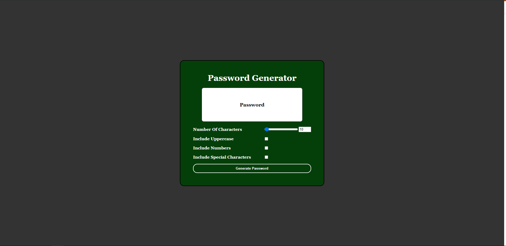

**What's the result of my work for this webpage?**  
This produced a very secure password generator with input validation. There is no way the user could break the code and the code itself isn't verbose or excessive.

**What did I learn from this assignment?**  
I learned what CSS is like integrated with JavaScript 6.0. I liked being able to use CSS along with JavaScript because it reinforced my CSS knowledge. I saw some tutorial videos online and I found a structure I really liked. It's very clean, simplistic, and professional. 
The only difference of JavaScript 6.0 from 5.0 that I saw in this exercise is I didn't use var and I used const for global scope variables, although it was used a some in local scope variables. Their values are absolute, meaning const values can never be declared. I also used let variables, which can only be used in the local scope. I explained all my code in the homework. 

**URLs for the Password Generator Website**  
<a href ="https://burkemm.github.io/Matts-Password-Generator/">My Password Generator</a>  
<a href ="https://github.com/burkemm/Matts-Password-Generator">My Password Generator Github Repository</a>

**What's the current webpage look like?**  

