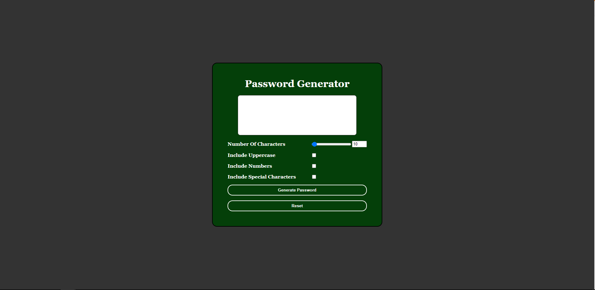

**What's the result of my work for this webpage?**  
This produced a very secure password generator with input validation. There is no way the user could break the code and the code itself isn't verbose or excessive.

**What did I learn from this assignment?**  
I learned a lot about the display flex option. I tinkered a lot with margins. I perfected posting hyperlinks that open in a new window. I learned to also have a lot of tenacity with web developing. It's easy to get stuck, but I don't get discouraged.

**URLs for the Horiseon Website**  
<a href ="https://burkemm.github.io/Matts-Password-Generator/">My Password Generator</a>  
<a href ="https://github.com/burkemm/Matts-Password-Generator">My Password Generator Github Repository</a>

**What's the current webpage look like?**  

<a href="https://github.com/burkemm/Matts-Web-Portfolio/blob/main/assets/images/Matts-Web-Portfolio.png"> Matt's Portfolio Website Screenshot link</a>